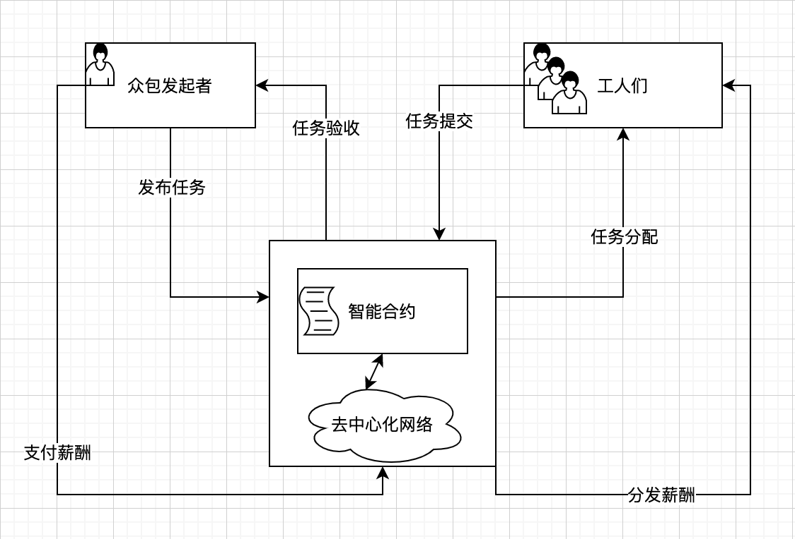

# ustc-crowdsourcing
## 业务需求分析
 众包还是吸引了大量世界各地的人，随着不断的应用于研宄，人们发现了许多的问题。业务需求包括但不限于：
（１）怎样吸引足够的人参与。众包可以将传统意义上工作分发给数以万计的地理位置上完全不相关的工人，使得请求者可以把大量的简单任务外包给匿名的非特定工人。然而这个前提就是有着大量的工人参加，一般这个问题可以用恰当的激励方法来解决。
（２）怎样选择激励的性质和程度。众包的激励不一定是金钱上的，还可以是非金钱的。非金钱激励可以是娱乐、积分、信息和利他主义的。不过它们在应对那种重复又无聊的任务时较为无力，所以大多数激励方式还是金钱方面的，而这样的市场就意味着成功完成一个工作需要高效的任务分配规则和支付规则。
（３）怎样从参与者那里获取诚实的类型报告。博弈论与机制设计中一般默认参与者（众包中一般指工人类型的代理或申请者类型的代理）是有策略、理性且智能的。这意味每个工人都是自私的，会想方设法让自己的效用最大化，最常见的手段就是瞒报或者误报，会导致博弈中均衡情况错综复杂，而这种不稳定性对博弈的双方尤其是期望方面都增加了变数与难度，甚至可能会导致利益受到损失。如何让工人诚实地报告自己的诚实类型是众包机制设计所面临的一个重要问题。
（４）怎样保证任务完成的质量、及时性和成本效益。工人的能力参差不齐，不同任务完成的质量或要求应被给予评估并给予不同的奖励。

这些问题不仅制约着众包，也对诸如群智感知之类的众包的应用有着各种影响一一群智感知本身有着各方面的限制，比如间歇性的WiFi、蜂窝网络以及空间内近距离的蓝牙、NFC等，传感器如陀螺仪、重力感应器等都需要消耗计算资源与能源也就是电力。怎样提高资源与能源的利用率是群智感知所面临的一大问题。除此之外，由于群智感知是众包的一种应用，所以其也有着众包的激励、诚实性等问题。博弈论和机制设计被证明是设计此类众包活动的关键因素。

## 概要设计方案
基于去中心化的区块链，其中用户的隐私与安全都是受到保障的，他们可以在区块链中通过广播发布任务、参与任务、提交解决方案、进行沟通、质量评估等。“智能合约”与“去中心化网络”将在其中分发众包任务，执行结果验收和最后发放激励。
整体设计架构如下图所示：

在这样的一个模型中，“众包发起者”是具有众包任务需求、需要在去中心化社区发布合约来解决的用户，该需求可表示为共计多个同质或工作量任务。在线机制设计是与时间紧密相连的，众包发起者会设定整个众包任务的的最终接收工人的截止时间。一旦时间超过，就意味着众包结束，并且不再接受新的工人。不过最后被分配的工人例外，此处的“众包结束”只是指逆向拍卖阶段，仍然允许最后的工人在指定的时间内完成任务并提交方案。
         该去中心化在线众包平台应该实现几个功能：它能够指定时间，能够保存工人的信息，能够自动分配任务，能够自行决定临界价值并进行支付。我们把本文的在线众包机制划分为顺序的５个阶段：任务发布、工人报价、任务分配、结果展示和奖励支付。

（１）任何人都可以作为发布者，只需向智能合约账户提交任务分发申请，内容包括任务名，持续时间，任务概要，预期价格。
（２）发布者发送到交易社区的信息是所有人都可见的，对此任务感兴趣的工人会通过社区上的信息向智能合约提交自己的预参与信息，即到达时间、离开时间、报价和任务名。
（３）当时间接近本阶段结束时，发布者执行任务分配函数，其会按照分配规则对该阶段内的所有成功提交且尚未分配的工人进行比对，选出报价最低的工人进行任务分配，并计算临界价值作为工人的奖励，并把该分配结果存储区块链中。
如果有冲突即多个工人有着与最低出价相同的出价，那么我们将选择最先报价的工人。其中临界价值的计算方式为：除已分配工人外其余工人报价的最低值，若该阶段只有一个工人报价，临界价值为该任务的预期价格。
（ 4 ）发布者执行结果展示函数向所有参与者公布此阶段结果。针对不同的需求，有两个模式可供发布者选择：公开与私密模式。如果结果展示函数处于公开模式，那么发布者和工人都可以通过该函数获取每个阶段的获胜者的编号、地址、到达时间、离开时间、出价、是否被支付以及支付金额等数据。如果结果展示函数处于隐私模式，则发布者和工人们只会看到每个阶段获胜者的地址。
（ 5 ）发布者验收工人提交的任务，执行奖励支付函数，会按照支付规则对己分配但未被支付且在此阶段离开的工人进行支付，一旦支付成功后会被标记为＂已支付＂。
为防止工人不诚信，系统给每个工人设置信用积分。若工人提交的任务不满足预期的指标，系统会扣除工人的信用积分，该积分与最终的支付值成正比，且积分只减不增。通过信用积分制度保证了工人们的任务完成度和参与积极性。 
